# Market microstructure lab

Published with the course instructor's agreement; all market data is anonymised.

**Baptiste Cristofari · NHH · FIN11 Trading and Market Microstructure · Fall 2026**

Over 5 classroom sessions I traded 3 different market structures on screen and 1, open outcry, by
voice. This page covers each session, compares how closely prices followed value, and my thoughts
on it. Reading time: ≈8 minutes.

**Contents:** [What I learnt](#what-i-learnt) · [Session 1](#session-1-bottles) ·
[Session 2](#session-2-news) · [Session 3](#session-3-two-stocks) ·
[Open outcry](#open-outcry) · [Session 4](#session-4-dealers) ·
[Why prices followed value](#the-big-question-why-did-prices-follow-the-fundamental-value-fv-in-session-3-and-not-the-others) ·
[What I built](#what-i-built) · [Repository](#repository)

| Session | Date | Market | My role |
|---|---|---|---|
| [1](#session-1-bottles) | 18 Aug | One asset, limit order book, 25,000 price cap | Trader |
| [2](#session-2-news) | 25 Aug | One stock, limit order book, private news | Not in this session |
| [3](#session-3-two-stocks) | 7 Sep | Two stocks, limit order books, three roles | News trader |
| [Outcry](#open-outcry) | 8 Sep | Trading floor simulation, no screen | Broker, buying 30,000 |
| [4](#session-4-dealers) | 14 Sep | Two stocks, dealers' quotes only | Asset exchanger |

## What I learnt

1. **Market structure decides whether prices match the fundamental value.** See
   [why prices followed value in Session 3 and not the others](#the-big-question-why-did-prices-follow-the-fundamental-value-fv-in-session-3-and-not-the-others).
2. **A market that is not efficient can ignore the fundamental value for hours.** In Session 2, 95%
   of trades went through at more than 2x the fundamental value the news traders were estimating.
3. **Wait for a good price, not for the clock.** In Session 4 I sold STOCK1 at up to 4x the
   fundamental value while spreads were tight, then left most of my STOCK2 to the end and had to
   buy it at 2x the fundamental value.
4. **Without a book, trading first is costly.** In the open outcry I bought too high in one of the
   room's first deals, and that single trade dropped my final rank from 4th to 9th out of 13.

---

## Session 1: bottles

*18 August 2026 · FTS Web Trader · 50 minutes*

**Setup.** Everyone traded the same invented asset, bottles. Each of us started with 20 or 60
bottles and no cash, and a bottle still held at the bell was worth nothing:

```
total gain = cash + realised utility + 0 × bottles
```

The session was a race to sell the endowment before the bell. The server also rejected any price
above 25,000, and that cap ended up shaping the whole session.

**Trade prices, bid and ask, and the bottles I held, over the 50 minutes**

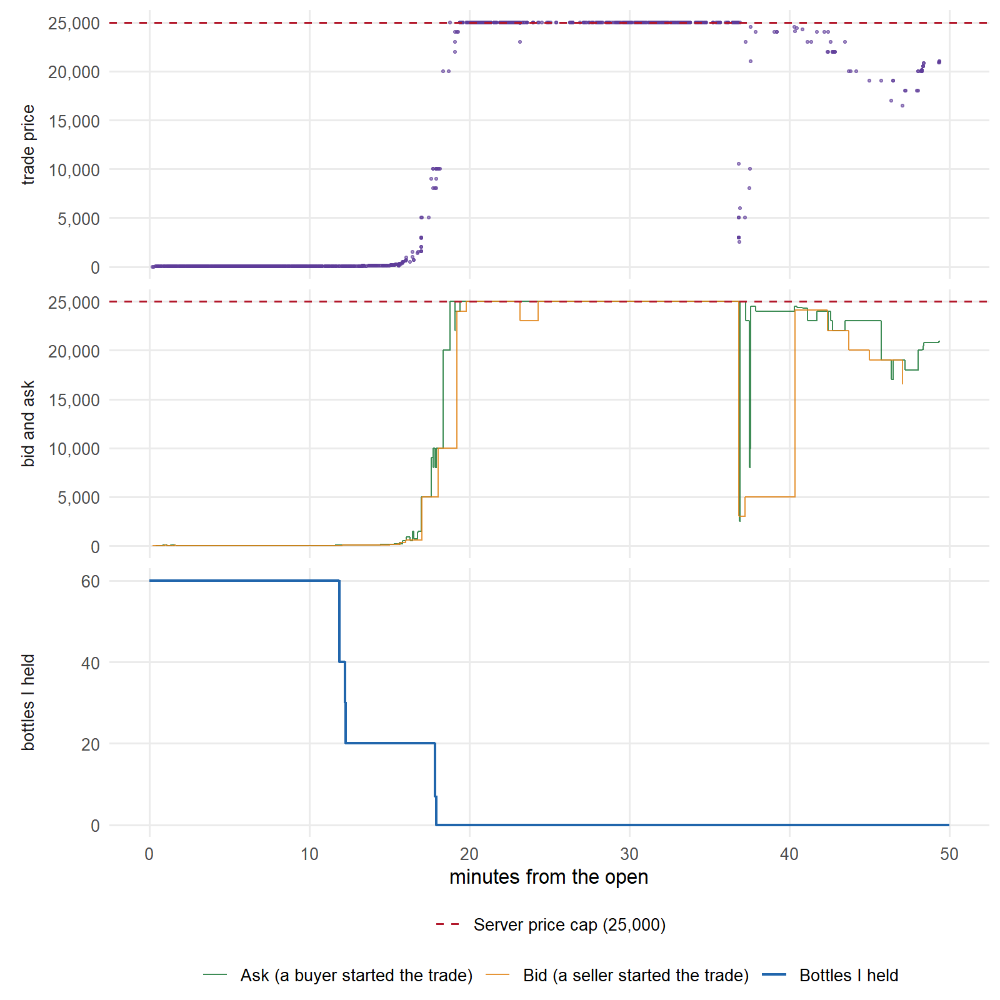

The bid and ask above come from the trades themselves: a trade started by a buyer went through at
the ask, and one started by a seller at the bid. The platform's order log cannot give a cleaner
answer, because it keeps orders nobody could fill: one ask at 2 sat in it all session while
bottles printed at 25,000.
<!-- src: data/session-1/book.csv and trades.csv (replay matches 2,612 of 2,617 trades to the order
they hit, yet stays crossed in 1,914 of 1,929 two-sided seconds) -->

**What happened.** It was the first session, so nobody knew how to act yet. For the first 15
minutes bottles traded for almost nothing, never above 130. Then the price shot up and first
reached the cap at minute 19.

**My trades.** I sold my 60 bottles in three steps: 20 at 45 and 20 at 48 around minute 12, then
the last 20 at 8,000 at minute 18, about a minute before the price first reached 25,000. Short
selling was not allowed, so I couldn't take advantage of the ridiculously high prices. The
software allowed it anyway, which I take to be a bug: 13 of the 40 seats sold more bottles than
any seat ever held, and the course's own results show a seat ending the day at −5 bottles and
another at −289,825K cash.
<!-- src: data/session-1/trades.csv (13 seats reach a cumulative net position below −60, the
largest endowment; the deepest is −183,620); T1-review-18-08-2026.pdf page 1, "Botl EoD" and
"$ EoD (K)" -->

**Result: 14th of about 40, finished flat, cash 161,859.60, or 2,698 a bottle, while bottles traded
at the 25,000 cap for about 18 minutes.** Not a good score. Waiting longer before selling would
have let me sell into that peak.
<!-- src: data/session-1/trades.csv (rows where ME is the seller; cash rebuilt from them matches my
own record exactly); endowments from net sales per seat, all 20 or 60 -->

Data: [data/session-1](data/session-1/)

---

## Session 2: news

*25 August 2026 · mtrader.org · 60 minutes*

I did not take part in this session.

**Setup.** One stock in a limit order book, with brokers and news traders. News traders received
private signals at random times, equal to the fundamental value plus up to ±4% noise, and were
scored on P&L marked to fundamental value within a ±20,000 position limit.

**Best bid and ask against fundamental value (log scale)**

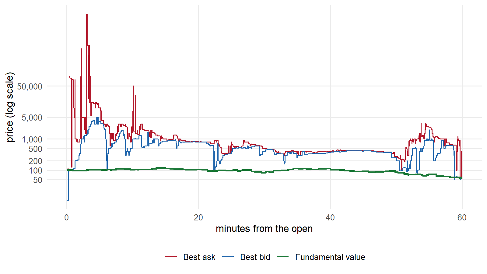

**What happened.** The market ran a bubble for the whole hour. 95% of the 4,279 trades went through
at more than 2x the fundamental value, and the median trade was 6.7x the fundamental value. Buyers
almost never found a price near value: the best ask sat above 2x value for 99% of the session.
Sellers had the opposite luck: the best bid sat above 2x the fundamental value for 91% of it. For a
news trader marked at value, every share sold above value was profit, and the bid offered that
nearly all hour.
<!-- src: data/session-2/trades.csv, quotes.csv and fv.csv; quote shares weighted by time -->

Data: [data/session-2](data/session-2/)

---

## Session 3: two stocks

*7 September 2026 · mtrader.org · 60 minutes*

**Setup.** Two stocks in limit order books, with three roles: asset exchangers, news traders and
arbitrage traders. I was one of the nine news traders following STOCK2, scored on P&L marked to
fundamental value, with a ±20,000 limit on each stock.

**Best bid and ask against fundamental value**

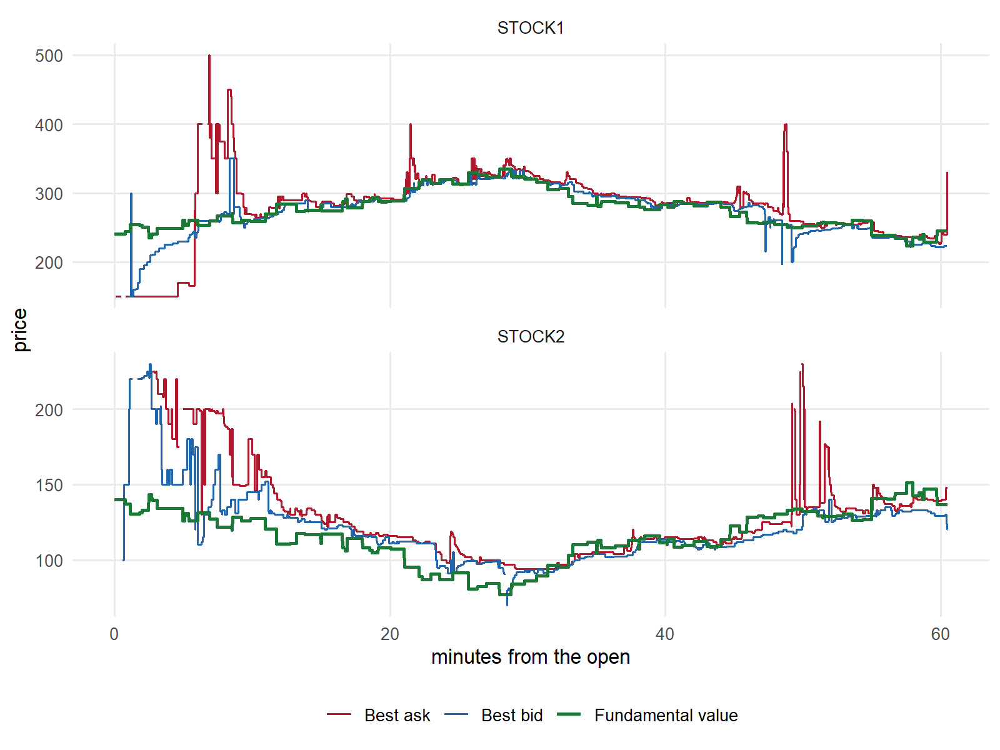

**What happened.** After a noisy first ten minutes, both books followed fundamental value for the
rest of the hour: 70% of trades went through within 10% of value. No other session came close
([why](#the-big-question-why-did-prices-follow-the-fundamental-value-fv-in-session-3-and-not-the-others)).
<!-- src: data/session-3/trades.csv and fv.csv -->

**My trades.** My best trade in terms of pure P&L was on STOCK1, where I had no signal: at minute
48 I sold 2,000 at 305 while it was worth 254, and bought them back at 240 seven minutes later. On
STOCK2, the stock I received news on, I sold 2,000 at 117 at minute 24 while the news said it was
worth 87, but I then stayed short as value climbed to 137 and had to buy 4,021 shares back at 140
to 148 at the close, which cost more than the sale had earned.
<!-- src: data/session-3/trades.csv (ME sells 700 + 1,300 STOCK1 at 305 at 48.5 min, buys 2,000 at
240 at 55.0 min) and fv.csv (STOCK1 254.4 at 2,900 s) -->

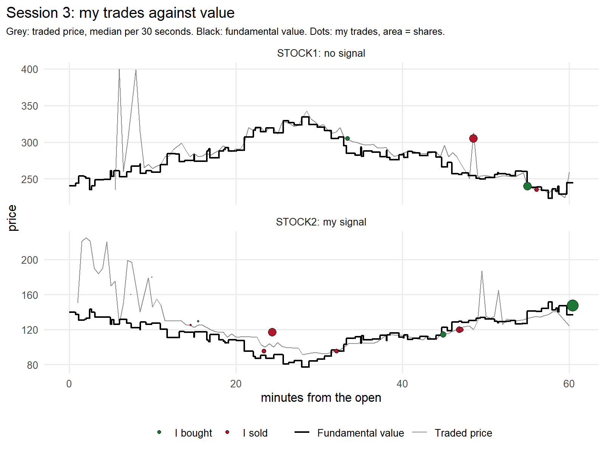

**Result: 7th of the 9 STOCK2 news traders, P&L −39,633, both positions flat at the bell.** STOCK1
earned 95,005 and STOCK2 lost 134,638. News traders were z-scored against the other news traders
on their stock, on three things: P&L with final positions marked to fundamental value, breaches of
the ±20,000 risk limit, and the ±20,000 target at the close, each stock separately. I breached
neither, so the whole score came from the P&L.
<!-- src: data/session-3/trades.csv and my-orders.csv (cash rebuilt from my fills is −39,633, both
positions 0); T3-results_review.pdf page 4: total score −0.12, P&L −40K, risk 0, target 0 -->

Data: [data/session-3](data/session-3/)

---

## Open outcry

*8 September 2026 · trading floor · 30 minutes*

**Setup.** The session I enjoyed the most. The class became a trading floor, with no screen and no
order book. Each of us was a broker with a number on a tag: odd numbers had to sell 30,000 shares
while even numbers had to buy 30,000. Two brokers agreed a price for a quantity by voice and both
wrote the trade on a paper card.

I was broker 10, a buyer. My card started at −30,000 shares and I brought it to zero in six trades
with four other brokers.

**Every trade of the session, with my six buys**

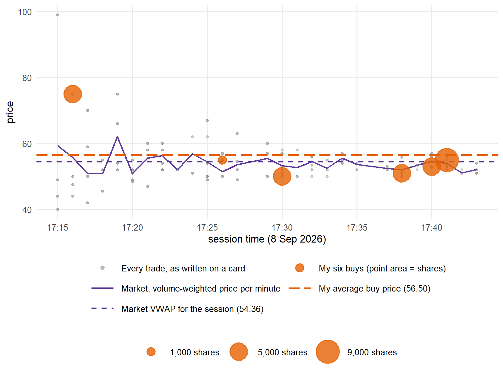

- **17:16, 5,000 at 75 from broker 7.** One of the first deals in the room, with no price yet to
  compare it with. The screen sessions had traded far higher, around 290 and 120 in Session 3, so
  75 looked cheap. Bad idea: only one trade all session, at 99, went through at a higher price. It
  taught me to be patient, so that I am not the one who pays for price discovery.
- **17:41, 9,000 at 55 from broker 23.** The session was nearly over and I still had a lot to buy,
  so I rushed and paid more than on the three trades before, but still about the volume-weighted
  price of that minute, so not a bad deal considering the quantity.
- **Overall class trades:** the prices paid slowly converged on the market's volume-weighted
  average price (market VWAP) for the session.

**Result: task completed, 30,000 bought for 1,695,000, an average of 56.50.** That was 2.14 above
the session's volume-weighted price of 54.36, and ranked me 9th out of 13. Without the first trade
my average would have been 52.80, which would have been 4th.

**Average buy price of each of the 13 buyers**

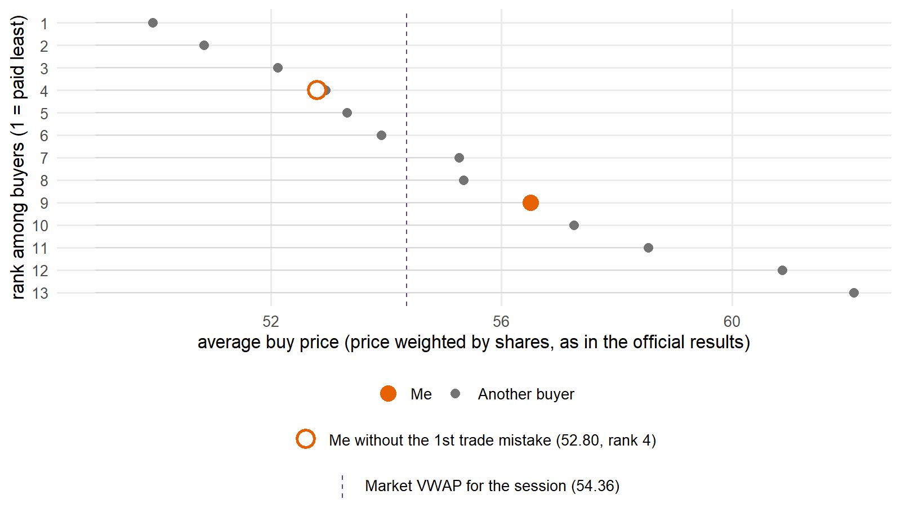

With nothing printed yet, I judged my first price against markets of previous sessions where prices
stayed mostly above the 100 mark, and it cost me the most. Leaving 9,000 for the end cost me too.
Spreading the buying across the half hour would have helped at both ends.
<!-- src: my paper trading card; the course's trade record for the session (not published),
averaged as in the official results: price weighted by shares, over each broker's own card.
Per-minute VWAP 17:41 = 53.93; without the 17:16 trade my average is 52.80, below 3 of the 12
other buyers -> 4th -->

<details>
<summary>My trading card</summary>

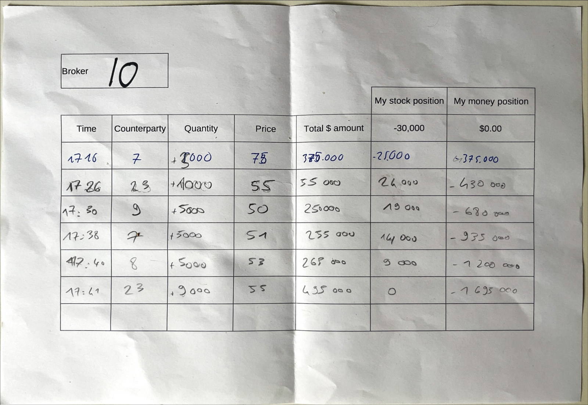

</details>

---

## Session 4: dealers

*14 September 2026 · mtrader.org · 60 minutes*

**Setup.** A quote-driven market in two stocks. Dealers posted quotes, and everyone else could only
take them with market orders. I did that as an asset exchanger with two jobs: sell 10,000 STOCK1
and buy 10,000 STOCK2 within the hour. I also had to stay within ±5,000 shares of a straight line
from my starting position to zero.

**What happened.** As shown in the graph below, dealers often quoted far from value and wide, so
crossing the spread was usually too expensive and I traded rarely: 43 fills, and only three of the
46 traders had fewer.

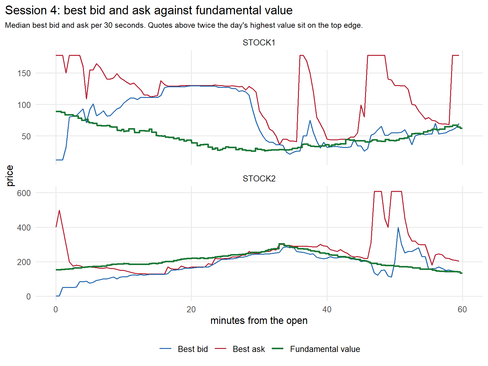

**My orders against the traded price and the quoted spread**

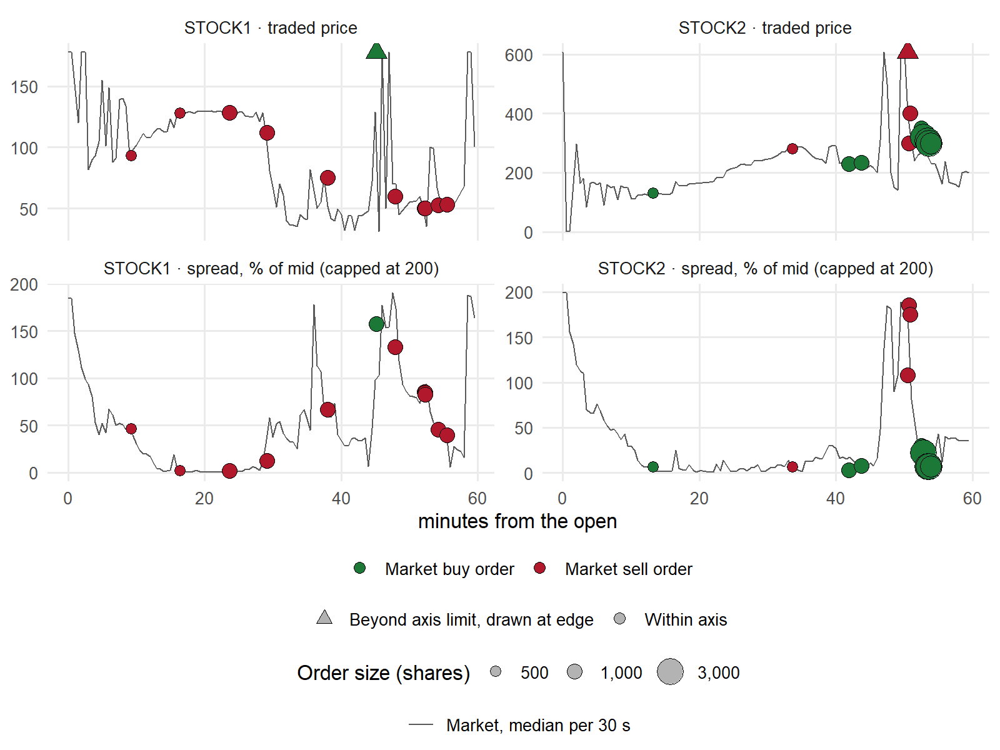

Each dot is one of my market orders, sized by the number of shares. A triangle marks an order whose
price or spread was beyond the axis.

**What went well**

- Reacting quickly to the fat-finger mistake. At minute 50 a dealer bid 3,000 for STOCK2 (instead
  of 300, I suppose), and I filled the order right away. Buying the 1,000 shares back near 300 added
  about 2.7 million: without it I would have finished about 2.4 million down instead of 341,000 up.
- Selling STOCK1 early and relatively high with small spreads
- Buying at times of low spread on STOCK2

**What went wrong**

- Buying 1,000 STOCK1 at 285. At minute 45 I mixed up STOCK1 and STOCK2 and so whether to look at
  the bid or the ask. Selling them at 60 three minutes later cost 225,000.
- Waiting too long. The last 6,000 STOCK1 were sold at around 50, near the day's lows.
<!-- src: data/session-4/trades.csv, my-orders.csv, quotes.csv and fv.csv. Final cash rebuilt from
my fills is 341,026 with both positions flat -->

**My position against the ±5,000 band**

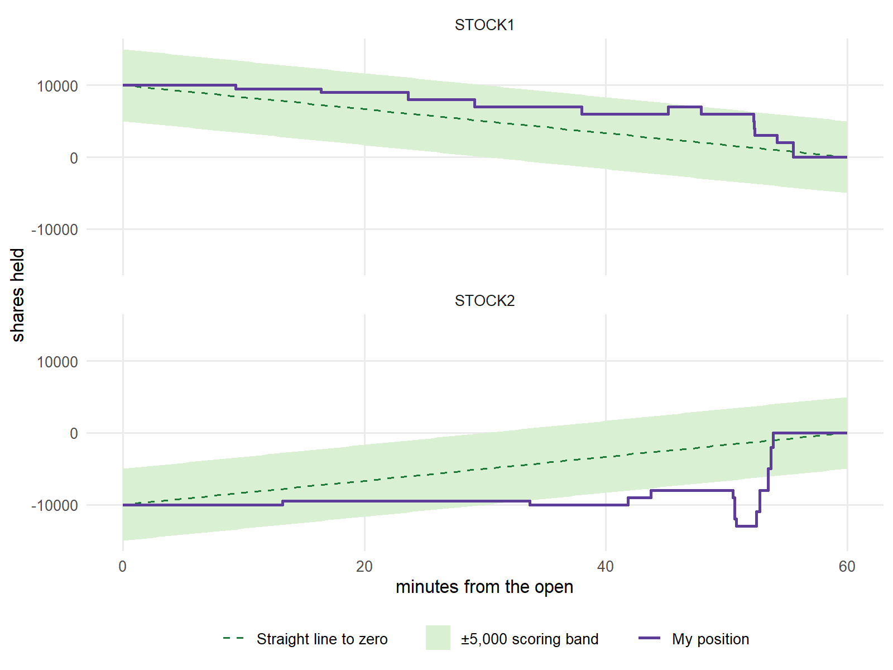

STOCK1 stayed inside the band all session. STOCK2 fell behind the line from about minute 33.

**What the band was teaching.** I guess it was the teacher's way of saying: buy a little all the
time instead of a lot at the end. On STOCK2 I did the opposite and over the session I paid 297 a
share, while the median STOCK2 trade went through at 217. Following the band with one simple rule,
1,000 shares every six minutes but waiting whenever the spread was above 20%, would have cost
about 212 a share. The last 1,000 still had to be bought at a wider spread, because it never came
back under 20% before the bell. Without that rule, one slot lands on an ask of 1,000 and the
average climbs to 291, so steady buying only pays if you also refuse wide spreads. The one thing I
would have given up is the fat-finger sale.
<!-- src: data/session-4/my-orders.csv (STOCK2 bought 15,500 at 297.34 on average); trades.csv
(median STOCK2 trade 217.00); quotes.csv replayed for STOCK2, 1,000 shares at the best ask at
minutes 3, 9, ..., 57, waiting while (ask - bid) / mid is above 20%: slots 1 to 9 fill at 209.2 on
average; slot 10 never gets under 20% (lowest 30.5% at minute 58.5), so it is bought at the
minute-57 ask of 240, giving 212.3 over 10,000 shares; taking the ask at each slot regardless:
290.6, slot 9 on an ask of 1,000 -->

Data: [data/session-4](data/session-4/)

---

## The big question: why did prices follow the fundamental value (fv) in Session 3 and not the others

Sessions 2, 3 and 4 all had a fundamental value that only some traders saw. Yet, the same class
produced three different markets.

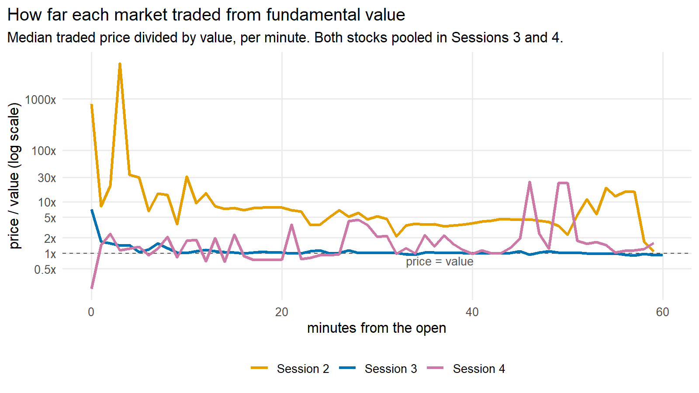

| | Session 2 | Session 3 | Session 4 |
|---|---|---|---|
| Trades within 10% of fv | 3% | 70% | 14% |
| Trades above 10x fv | 34% | 0% | 14% |
| Participants that received fv information | 24 of 41 | 20 of 40 | 14 of 56 |
| Who could post prices | everyone | everyone | the 28 dealers only |
| Opening | continuous, empty book | call auction (STOCK1) | continuous, empty books |
<!-- src: data/session-2..4 trades.csv and fv.csv; trader type counts from the official
participants files; the session briefings -->

Below are my hypotheses to explain why prices followed fv or not, built from the course material
and the data.

**A. The opening set the tone.** Sessions 2 and 4 opened into continuous trading from an empty
book. Look at Session 2: its first trade went through at 110, and at second 20 one printed at
100,000, about 1,000x fv. The median trade in the first 5 minutes was 29x fv, and the market never
came back: 34% of all its trades were >10x fv.

Now, what about Session 3? STOCK1 opened with a 5-minute call auction. It cleared at 235 while fv
was 261, and then traded close to value from then on. The auction also gave informed traders time
to act on what they knew: the first value push went out at second 0 and 11 more had arrived by the
time the auction cleared at second 348, so the nine news traders on STOCK1 could price the auction
from their signals. STOCK2 had no auction and opened at 994, 7x fv, but its median trade was within
20% of value from minute 10, possibly guided by STOCK1's price traders saw on the side of their
screen.
<!-- src: data/session-3/news.csv (12 pushes at or before 348 s) and trades.csv (the auction prints
carry auctionId 1 at t_sec 348) -->

**B. More informed traders did not help.** Agreement among them mattered more.

Session 2 had the larger informed group, 24 of its 41 seats, and because it traded a single stock
all 24 were estimating the same value. Yet each of them received one of three noisy streams: each
stream was off by about 1.3% on average and never more than 4%, with no bias up or down. The three
streams were independent, so two traders could be up to 8% apart.

Session 3 split a smaller group across the 2 stocks, 9 news traders each, and gave everyone
following a stock the same number: in the data the news matches the true value almost exactly.

Hence, traders working from the same number could pull a book towards it, while 24 working
from three numbers 8% apart left enough disagreement for a bubble to sit in.
<!-- src: T2/news-traders-and-brokers.csv against T2/FV.csv, 100 pushes per stream: mean absolute gap
1.36%, 1.13%, 1.43% (1.31% pooled), max 3.99%, mean signed gap 0.00%. Official participants files
for the counts; T3/news.csv against T3/FV.csv for the Session 3 gap: median 0%, max 3.3% -->

**C. Two traders knew something nobody else did.** Session 3's other informed seats were the 2
arbitrage traders (only there in Session 3), and what they were given was not either stock's value
but the ratio between the two. That is a signal you can only trade by comparing the books, which is
one more force pushing both prices towards the same relationship as the values.
<!-- src: Session_10_trading_3.pdf, "Arbs/prop traders: forecast on relative FV of the 2 stocks";
T3/participants.csv counts 2 prop seats; T3/news.csv carries a relative column -->

**D. Informed traders could post prices in Sessions 2 and 3, but not in Session 4.** In Sessions 2
and 3, a trader with a value signal could post a limit order at that value. In Session 4, informed
traders could only use market orders, and only dealers could quote. The dealer lecture from class
explains it: dealers facing better-informed traders widen their spreads to cover what they lose to
them, and move their quotes only after informed orders hit them. Session 4 also had the smallest
informed share of the three, one trader in four.

**E. The class had learnt from Session 2.** It was the first time the class traded an order book
against a fv, and the only practice before it was Session 1, where prices ran up to the cap. So the
class came to Session 2 with no experience of trading around a value. The Session 2 results came
out before Session 3, so by then the whole class had seen the scores from a market that ignored
value for an hour.

**F. Session 4 forced unreasonable quoting.** Dealers were required to make markets, and quotes as
high as 10,000 appeared in both stocks. Such quotes keep a dealer present without trading much, but
a market order that reaches one still fills there, and 14% of Session 4 trades went through above
10x fv.

**Conclusion:** only Session 3 had all six conditions: an auction for the first STOCK1 price (A),
one shared estimate per stock (B), two arbitrage traders tying the stocks together (C), informed
traders who could post prices (D), a class that had already seen what a bubble costs (E), and no
one forced to quote prices they did not mean (F).
<!-- src, one per condition: (A) auction: data/session-3/trades.csv, the STOCK1 prints at t_sec 348
carry auctionId 1 in the official export; (B) one shared estimate: data/session-3/news.csv against
fv.csv, median gap 0%, max 3.3%, versus the three Session 2 streams in the official
news-traders-and-brokers.csv, up to 8.3% apart; (C) arbitrage traders: T3/participants.csv, 2 prop
seats, only in Session 3; (D) posting prices: the official Session 2 orders.csv holds 2,371 limit
orders from news seats, the Session 3 case slides list limit orders for every role, and the
Session 4 briefing gives informed traders market orders only; (E) Session 2 results: T2-results.pdf
is dated 26 Aug and T2-results_review.pdf 3 Sep (PDF metadata), both before 7 Sep; (F) forced
quoting: only the Session 4 briefing requires dealers to make markets -->

---

## What I built

The class traded through a browser screen that redrew the tape only now and then and kept no
history. I wanted every trade and every book change as it happened, in a second window, without
touching the tab I was trading in. So I built it using Claude Code.

```
trading tab on Chrome → Chrome extension → local server (saves every message) → viewer
```

A Chrome extension replaces the page's WebSocket constructor before the page loads, so every
connection the page opens gets a listener, reconnects included. The extension forwards the messages
to a small server on my machine, which saves them and feeds the viewer window. FTS Web Trader
(Session 1) never reports your own fills, so the server infers them from changes in cash and
holdings; mtrader.org (Sessions 2 to 4) acknowledges every fill, so nothing there has to be
inferred. Recording was read-only; the tool never sent an order.

---

## Repository

[`data/`](data/) holds the anonymised market data, where every trader is a random label.
[`charts/`](charts/) holds the ten charts: eight drawn in R from that data, and the two open-outcry
charts, built from the course's trade record, which is not published. [`images/`](images/) holds
my open-outcry trading card.

Built with Claude Code.
